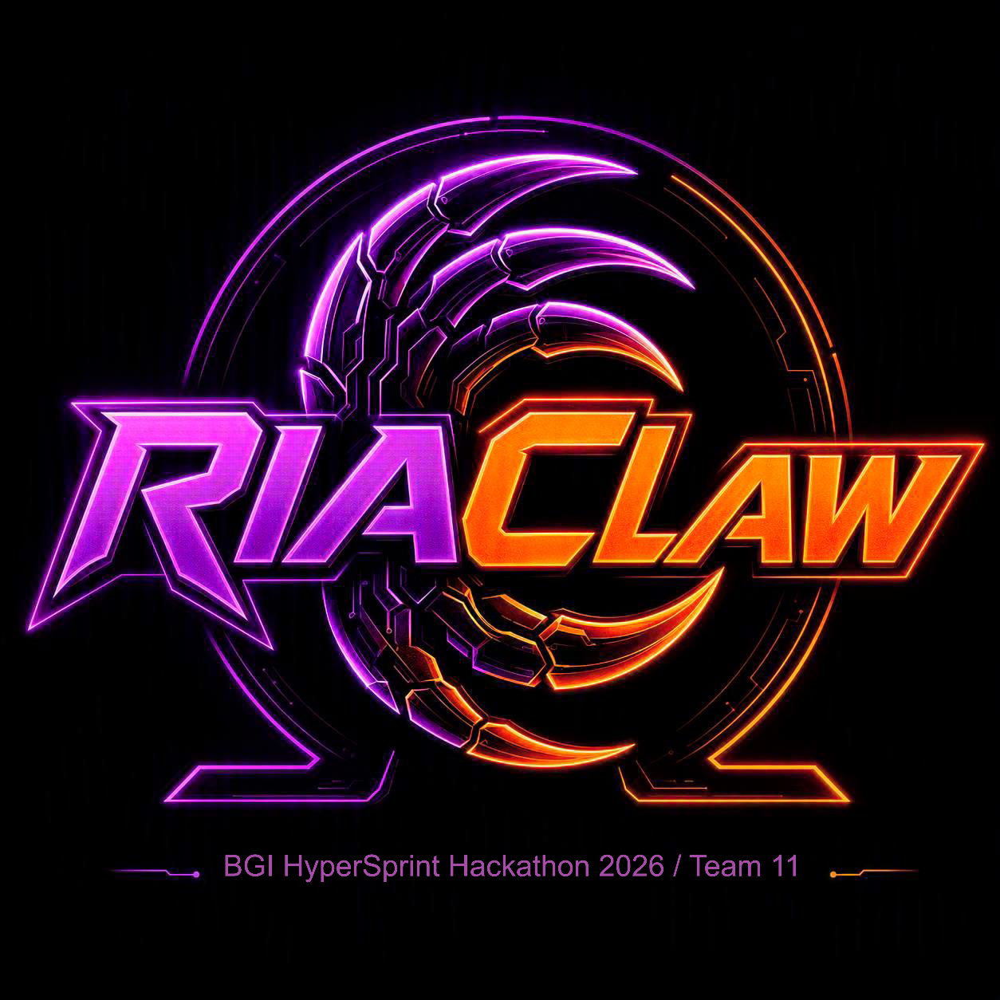

# OmegaClaw-RIA

**Team 11 of BGI HyperSprint - OmegaClaw, Track 2**

---

## 🎯 What This Is

OmegaClaw-RIA is a **non-extractive AI safety framework** designed for Biological General Intelligence (BGI) systems. Rather than treating human pain and crisis language as training data to be harv[...]